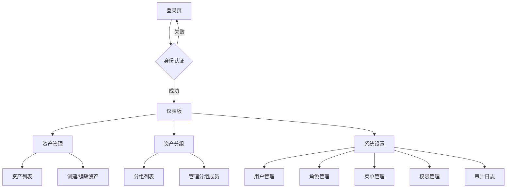

# Ops Middle Platform - 产品需求文档 (PRD)

## 1. 产品概述

Ops Middle Platform 是一个面向运维团队的中后台管理系统，提供统一的运维资产管理和权限控制功能。通过集中化的 CMDB 资产管理、RBAC 权限体系和操作审计，帮助运维团队高效管理基础设施资源。

目标用户为运维工程师、系统管理员和技术管理人员，解决传统运维中资产信息分散、权限管理复杂的问题，提升运维效率和系统可观测性。

---

## 2. 核心功能

### 2.1 用户角色

| 角色 | 创建方式 | 核心权限 |
|------|----------|----------|
| 超级管理员 | 初始化脚本创建 | 全量权限，包括用户管理、角色分配、菜单配置、权限授予 |
| 运维工程师 | 管理员创建 | 按角色分配的菜单访问权限，按资源/分组分配的 read/write 权限 |
| 访客用户 | 管理员创建 | 仅限被授予 read 权限的资源查看，不可修改任何数据 |

### 2.2 功能模块

本平台包含以下核心页面：

1. **登录页**：用户名密码认证，JWT Token 颁发。
2. **仪表板**：资产总量统计及按类型、云厂商、状态的分布图表。
3. **资产管理**：CMDB 资产列表、资产创建/编辑/删除、多维度筛选。
4. **资产分组**：资产分组的创建与管理，支持将资产加入/移出分组。
5. **系统设置**：用户管理、角色管理、菜单管理、资源权限管理、审计日志。

### 2.3 页面详情

| 页面名称 | 模块 | 功能描述 |
|----------|------|----------|
| 登录页 | 身份认证 | 用户名密码登录，JWT Token 认证，登录事件记录审计日志 |
| 仪表板 | 数据总览 | 资产总量、按类型分布（饼图）、按云厂商分布（柱状图）、按状态分布 |
| 资产列表 | 资产管理 | 分页展示资产，支持按类型/云厂商/状态/名称/IP/关键字筛选，创建/编辑/删除 |
| 资产分组 | 分组管理 | 分组列表、创建/编辑/删除分组、管理分组内的资产成员 |
| 用户管理 | 系统设置 | 用户列表、创建/编辑用户、分配角色、激活/禁用账号 |
| 角色管理 | 系统设置 | 角色列表、创建/编辑/删除角色、配置角色可访问的菜单 ID |
| 菜单管理 | 系统设置 | 树形菜单结构配置、图标设置、排序调整、父子菜单关联 |
| 权限管理 | 系统设置 | 为用户授予/撤销对指定资产或资产分组的 read/write 权限 |
| 审计日志 | 系统设置 | 查看所有操作记录，支持按用户名/操作类型/目标类型/IP 筛选 |

---

## 3. 核心流程

### 3.1 用户登录流程

用户访问系统进入登录页，输入用户名密码进行身份认证。验证通过后颁发 JWT Token（有效期 30 分钟），前端存储至 localStorage 并跳转仪表板。后续请求通过 `Authorization: Bearer {token}` 头携带令牌。

### 3.2 资产管理流程

用户通过侧边菜单进入资产管理模块，查看资产列表。支持多条件组合筛选（类型、云厂商、状态、名称、IP、关键字、所属分组）。超级管理员可查看所有资产；普通用户只能查看被授予权限（直接授权或通过分组授权）的资产。有 write 权限的用户可进行编辑/删除操作。

### 3.3 权限管理流程

超级管理员在「权限管理」页面为指定用户授予对某个资产或资产分组的 read/write 权限。权限可随时撤销。所有授权/撤销操作均记录审计日志。

---

## 4. 用户界面设计

### 4.1 设计风格

- **UI 框架**：Ant Design Pro（ProLayout、ProTable、ModalForm 等）
- **主色调**：Ant Design 默认蓝色 (#1677ff)
- **布局风格**：左侧菜单 + 顶部导航的经典 Admin 布局，内容区域采用卡片式设计
- **图标风格**：Ant Design Icons 图标库

### 4.2 页面设计概览

| 页面名称 | UI 元素 |
|----------|---------|
| 登录页 | 居中 Card 布局，Logo + 用户名/密码输入框 + 登录按钮 |
| 仪表板 | 四格统计卡片 + 饼图（资产类型分布）+ 柱状图（云厂商分布） |
| 资产列表 | ProTable 表格，顶部筛选栏，工具栏含新建按钮，行操作含编辑/删除 |
| 资产分组 | ProTable 表格，行操作含编辑/资产成员/删除，Drawer 管理分组成员 |
| 用户/角色管理 | ProTable + ModalForm，支持新建、编辑、删除 |
| 审计日志 | ProTable 只读表格，顶部筛选栏，支持按多字段过滤 |

### 4.3 交互设计

- 所有写操作（创建/编辑/删除）通过 Modal 对话框完成，避免页面跳转
- 删除操作需 Popconfirm 二次确认
- 表单提交时进行前端验证，错误信息通过 message 提示
- 操作成功/失败均有 message 反馈
