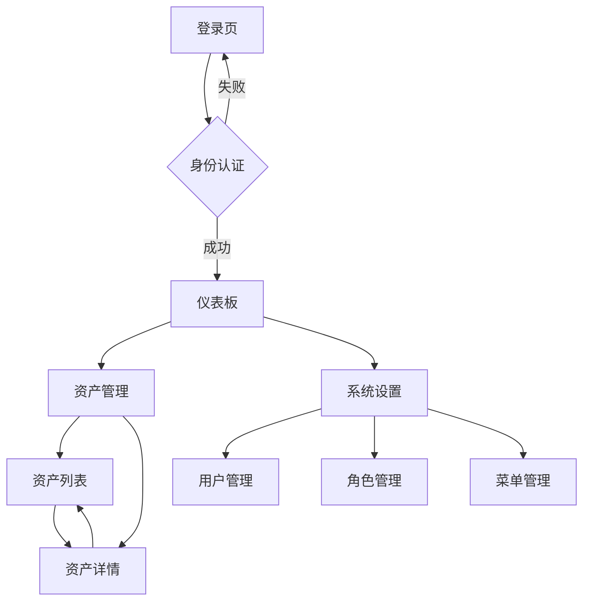

## 1. 产品概述
Ops Middle Platform是一个面向运维团队的中后台管理系统，提供统一的运维资产管理和系统配置功能。通过集中化的CMDB资产管理和权限控制，帮助运维团队高效管理基础设施资源。

目标用户为运维工程师、系统管理员和技术管理人员，解决传统运维中资产信息分散、权限管理复杂的问题，提升运维效率和系统可观测性。

## 2. 核心功能

### 2.1 用户角色
| 角色 | 注册方式 | 核心权限 |
|------|----------|----------|
| 系统管理员 | 后台创建 | 全权限，包括用户管理、角色分配、系统配置 |
| 运维工程师 | 管理员创建 | 资产管理、配置查看、基础操作权限 |
| 访客用户 | 管理员创建 | 仅查看权限，不能修改任何数据 |

### 2.2 功能模块
本平台包含以下核心页面：
1. **登录页**：统一身份认证、多因素认证支持。
2. **仪表板**：运维数据总览、关键指标展示、快速导航。
3. **资产管理**：CMDB资产列表、资产详情查看、资产编辑管理。
4. **系统设置**：用户管理、角色权限配置、菜单管理、系统参数配置。

### 2.3 页面详情
| 页面名称 | 模块名称 | 功能描述 |
|----------|----------|----------|
| 登录页 | 身份认证 | 支持用户名密码登录，集成企业SSO，提供记住密码和自动登录功能 |
| 仪表板 | 数据总览 | 展示系统运行状态、资产统计、告警信息、快捷操作入口 |
| 仪表板 | 快速导航 | 提供常用功能的快速访问入口，支持自定义快捷方式 |
| 资产管理 | 资产列表 | 分页展示所有IT资产，支持搜索、筛选、排序，批量操作功能 |
| 资产管理 | 资产详情 | 显示资产详细信息，包括基础信息、配置信息、关联关系、操作历史 |
| 资产管理 | 资产编辑 | 支持资产信息的新增、修改、删除，提供表单验证和批量导入 |
| 系统设置 | 用户管理 | 用户列表展示、用户创建编辑、密码重置、状态管理 |
| 系统设置 | 角色管理 | 角色创建、权限分配、角色成员管理、数据权限控制 |
| 系统设置 | 菜单管理 | 菜单结构配置、权限绑定、图标设置、排序调整 |
| 系统设置 | 系统配置 | 系统参数设置、日志配置、通知配置、备份恢复 |

## 3. 核心流程

### 3.1 用户登录流程
用户访问系统首先进入登录页，输入用户名密码进行身份认证。系统验证通过后生成JWT令牌，前端存储令牌并跳转到仪表板。支持单点登录集成，可对接企业身份认证系统。

### 3.2 资产管理流程
用户通过导航菜单进入资产管理模块，默认展示资产列表页面。可以通过搜索框快速查找资产，或使用高级筛选功能进行精确查询。点击资产名称进入详情页查看完整信息，有编辑权限的用户可以进行修改操作。

### 3.3 权限管理流程
系统管理员在系统设置中进行权限配置，包括创建角色、分配权限、设置用户角色。权限控制采用RBAC模型，支持菜单级和功能级的细粒度权限控制。

## 4. 用户界面设计

### 4.1 设计风格
- **主色调**：深蓝色 (#1890ff) 作为主品牌色，浅灰色 (#f5f5f5) 作为背景色
- **按钮样式**：采用Ant Design的圆角按钮风格，主按钮使用渐变效果
- **字体规范**：主字体使用系统默认字体，标题14-16px，正文12-14px
- **布局风格**：采用左侧菜单 + 顶部导航的经典Admin布局，内容区域采用卡片式设计
- **图标风格**：使用Ant Design官方图标库，保持风格一致性

### 4.2 页面设计概览
| 页面名称 | 模块名称 | UI元素 |
|----------|----------|--------|
| 登录页 | 登录表单 | 居中布局，品牌Logo，用户名密码输入框，登录按钮，记住密码复选框 |
| 仪表板 | 数据卡片 | 四宫格布局展示核心指标，每个卡片包含标题、数值、趋势图标 |
| 资产列表 | 表格区域 | 顶部搜索栏和筛选器，中间数据表格支持排序，底部分页器 |
| 资产详情 | 信息展示 | 采用描述列表(Descriptions)组件，分组展示不同类型信息 |
| 用户管理 | 操作区域 | 顶部工具栏包含新增、搜索、批量操作按钮，表格展示用户列表 |

### 4.3 响应式设计
采用桌面端优先的设计策略，主布局在1200px以上宽度时显示完整侧边菜单。在768px-1200px之间时，侧边菜单自动收起为图标模式。小于768px时，侧边菜单变为抽屉式，通过汉堡菜单切换显示。所有表格和表单都支持横向滚动，确保在小屏幕设备上的可用性。

### 4.4 交互设计
- 所有操作按钮提供加载状态反馈
- 表单提交时进行前端验证，错误信息友好提示
- 数据加载使用骨架屏提升用户体验
- 重要操作（如删除）需要二次确认
- 支持键盘快捷键操作