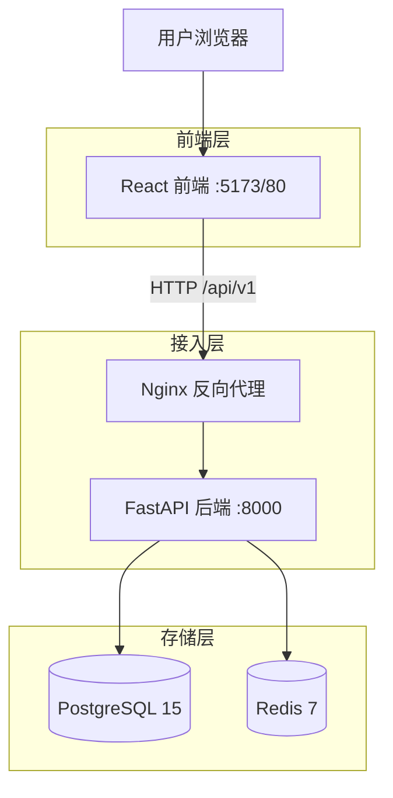
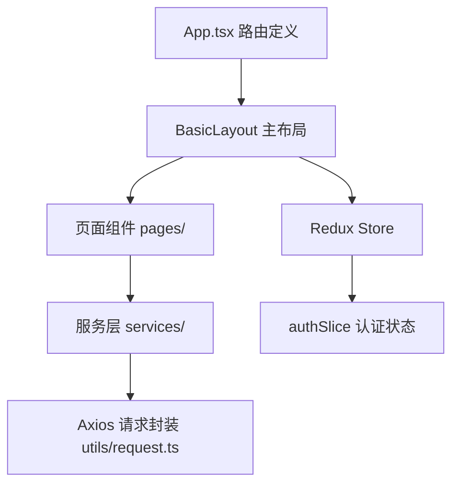

# Ops Middle Platform - 技术架构文档

## 1. 架构设计

项目采用**前后端分离**的单体架构（Modular Monolith），后端为单一 FastAPI 进程，通过路由模块化组织业务边界。



---

## 2. 技术栈

### 后端

| 组件 | 版本 | 用途 |
|------|------|------|
| Python | 3.12 | 运行时 |
| FastAPI | >=0.100 | Web 框架，异步 ASGI |
| SQLAlchemy | >=2.0 | ORM，全异步模式 |
| asyncpg | >=0.28 | PostgreSQL 异步驱动 |
| Alembic | >=1.11 | 数据库迁移 |
| Pydantic | >=2.0 | 数据验证与序列化 |
| python-jose | >=3.3 | JWT Token 签发/验证 |
| passlib[bcrypt] | >=1.7 | 密码哈希 |
| loguru | >=0.7 | 日志 |
| uvicorn | >=0.20 | ASGI 服务器 |

### 前端

| 组件 | 版本 | 用途 |
|------|------|------|
| React | ^19.2 | UI 框架 |
| TypeScript | ~5.9 | 类型安全 |
| Vite | ^7.2 | 构建工具 |
| react-router | ^7.13 | 路由管理 |
| Ant Design | ^5.29 | 基础 UI 组件库 |
| @ant-design/pro-components | ^2.8 | ProTable、ProLayout、ModalForm 等企业组件 |
| @ant-design/plots | ^2.6 | 数据可视化图表 |
| @reduxjs/toolkit | ^2.11 | 状态管理 |
| react-redux | ^9.2 | React-Redux 绑定 |
| axios | ^1.13 | HTTP 客户端 |

---

## 3. 路由定义

### 前端路由

| 路由路径 | 对应页面 |
|----------|---------|
| `/login` | 登录页 |
| `/dashboard` | 仪表板（默认首页） |
| `/assets` | 资产列表 |
| `/assets/groups` | 资产分组管理 |
| `/settings/users` | 用户管理 |
| `/settings/roles` | 角色管理 |
| `/settings/menus` | 菜单管理 |
| `/settings/permissions` | 权限管理 |
| `/settings/audit-logs` | 审计日志 |

### 后端 API 路由（统一前缀 `/api/v1`）

| 方法 | 路径 | 说明 |
|------|------|------|
| POST | `/auth/login` | 登录，返回 JWT Token |
| GET | `/users/me` | 获取当前登录用户信息 |
| GET/POST | `/users/` | 用户列表/创建用户 |
| PUT | `/users/{id}` | 更新用户 |
| GET/POST | `/roles/` | 角色列表/创建角色 |
| PUT/DELETE | `/roles/{id}` | 更新/删除角色 |
| GET/POST | `/menus/` | 菜单树/创建菜单 |
| PUT/DELETE | `/menus/{id}` | 更新/删除菜单 |
| GET/POST | `/assets/` | 资产列表/创建资产 |
| PUT/DELETE | `/assets/{id}` | 更新/删除资产 |
| GET/POST | `/asset-groups/` | 分组列表/创建分组 |
| GET/PUT/DELETE | `/asset-groups/{id}` | 分组详情/更新/删除 |
| POST/DELETE | `/asset-groups/{id}/resources/{rid}` | 添加/移除分组成员 |
| GET/POST | `/permissions/` | 权限列表/授予权限 |
| DELETE | `/permissions/{id}` | 撤销权限 |
| GET | `/stats/summary` | 资产统计概览 |
| GET | `/audit/logs` | 审计日志列表 |

---

## 4. API 规范

### 4.1 认证

**用户登录**

```
POST /api/v1/auth/login
Content-Type: application/x-www-form-urlencoded

username=admin&password=yourpassword
```

响应：

```json
{
  "access_token": "eyJhbGciOiJIUzI1NiIsInR5cCI6IkpXVCJ9...",
  "token_type": "bearer"
}
```

后续请求在 Header 中携带：

```
Authorization: Bearer {access_token}
```

**获取当前用户**

```
GET /api/v1/users/me
```

### 4.2 资产管理

**获取资产列表**

```
GET /api/v1/assets/?skip=0&limit=20&type=host&provider=aws&status=running&keyword=web
```

查询参数：

| 参数 | 类型 | 说明 |
|------|------|------|
| skip | int | 偏移量，默认 0 |
| limit | int | 每页条数，默认 100 |
| type | string | 资产类型（host/database/middleware 等） |
| category | string | 资产分类 |
| provider | string | 云厂商（aws/aliyun/onprem/k8s） |
| status | string | 状态（running/stopped/unknown） |
| name | string | 名称模糊匹配 |
| ip_address | string | IP 模糊匹配 |
| region | string | 区域模糊匹配 |
| keyword | string | 同时搜索 name 和 ip_address |
| group_id | int | 按分组过滤 |

**创建资产**

```
POST /api/v1/assets/
Content-Type: application/json

{
  "name": "web-server-01",
  "type": "host",
  "provider": "aws",
  "region": "us-east-1",
  "ip_address": "10.0.0.1",
  "status": "running",
  "data": {"cpu": "4", "memory": "8GB"},
  "tags": {"env": "prod"}
}
```

---

## 5. 前端架构



### 目录结构

```
web/src/
├── components/
│   └── Layout/
│       └── BasicLayout.tsx   # ProLayout 主布局，动态菜单渲染
├── pages/
│   ├── Login/                # 登录页
│   ├── Dashboard/            # 仪表板（统计图表）
│   ├── Assets/
│   │   ├── index.tsx         # 资产列表
│   │   └── Groups/           # 资产分组管理
│   └── Settings/
│       ├── Users/            # 用户管理
│       ├── Roles/            # 角色管理
│       ├── Menus/            # 菜单管理
│       ├── Permissions/      # 权限管理
│       └── AuditLogs/        # 审计日志
├── services/                 # API 调用层（按模块拆分）
│   ├── auth.ts
│   ├── users.ts
│   ├── roles.ts
│   ├── menus.ts
│   ├── assets.ts
│   ├── groups.ts
│   ├── permissions.ts
│   ├── dashboard.ts
│   └── audit.ts
├── store/
│   ├── index.ts              # Redux store 配置
│   ├── hooks.ts              # useAppDispatch, useAppSelector
│   └── slices/
│       └── authSlice.ts      # 认证状态（isAuthenticated, user, token）
├── types/
│   └── index.ts              # 全局 TypeScript 类型定义
├── utils/
│   └── request.ts            # Axios 实例，请求/响应拦截器
└── config/
    └── routes.ts             # 静态菜单路由配置
```

---

## 6. 数据模型

### 6.1 实际 TypeScript 类型定义

```typescript
interface User {
  id: number;
  username: string;
  email: string;
  is_active: boolean;
  is_superuser: boolean;
  role_id: number | null;
  role?: Role;
  created_at: string;
  updated_at: string;
}

interface Role {
  id: number;
  name: string;
  description?: string;
  permissions: Record<string, any>;  // {"menu_ids": [1, 2, 3]}
}

interface Resource {
  id: number;
  name: string;
  type: string;
  category?: string;
  provider: string;
  region?: string;
  ip_address?: string;
  description?: string;
  location?: string;
  status: string;
  business_unit?: string;
  owner?: string;
  data: Record<string, any>;
  tags: Record<string, any>;
  groups?: ResourceGroup[];
  created_at: string;
  updated_at: string;
}

interface ResourceGroup {
  id: number;
  name: string;
  description?: string;
  created_at: string;
  updated_at: string;
}
```

### 6.2 Redux Store 结构

项目当前仅有 `auth` slice，资产等数据通过 ProTable 的 `request` 直接请求，不经过 Redux。

```typescript
interface RootState {
  auth: {
    isAuthenticated: boolean;
    user: User | null;
    loading: boolean;
    error: string | null;
  };
}
```

---

## 7. 开发规范

### 7.1 代码规范

- 使用 TypeScript 进行类型检查，避免使用 `any`
- 遵循 ESLint 配置规范
- 组件命名采用 PascalCase（`UserList.tsx`）
- 工具/服务文件采用 camelCase（`request.ts`）
- 常量命名采用 UPPER_SNAKE_CASE

### 7.2 Git 提交规范

| 前缀 | 说明 |
|------|------|
| `feat:` | 新功能 |
| `fix:` | 修复 bug |
| `docs:` | 文档更新 |
| `style:` | 代码格式调整（不影响逻辑） |
| `refactor:` | 代码重构 |
| `chore:` | 构建工具或配置变更 |

### 7.3 接口规范

- 统一 RESTful 风格，前缀 `/api/v1`
- 认证：`Authorization: Bearer {token}` Header
- 分页：使用 `skip`/`limit` 参数（非 `page`/`pageSize`）
- 错误响应格式：`{"detail": "错误描述"}`
- HTTP 状态码语义：401 未认证、403 无权限、404 资源不存在
