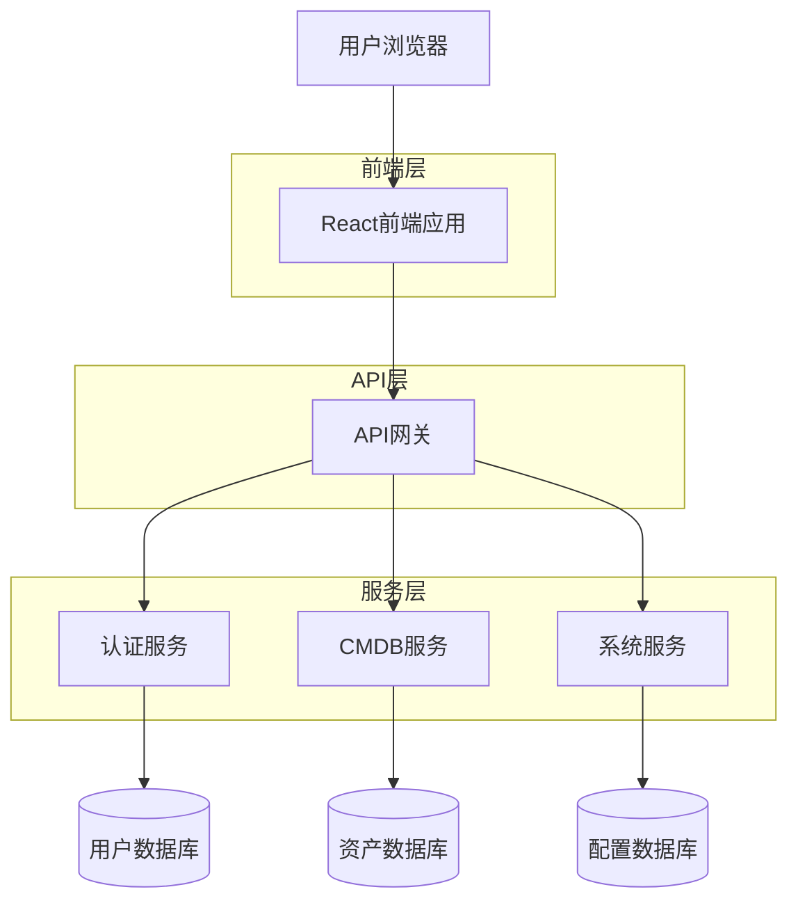
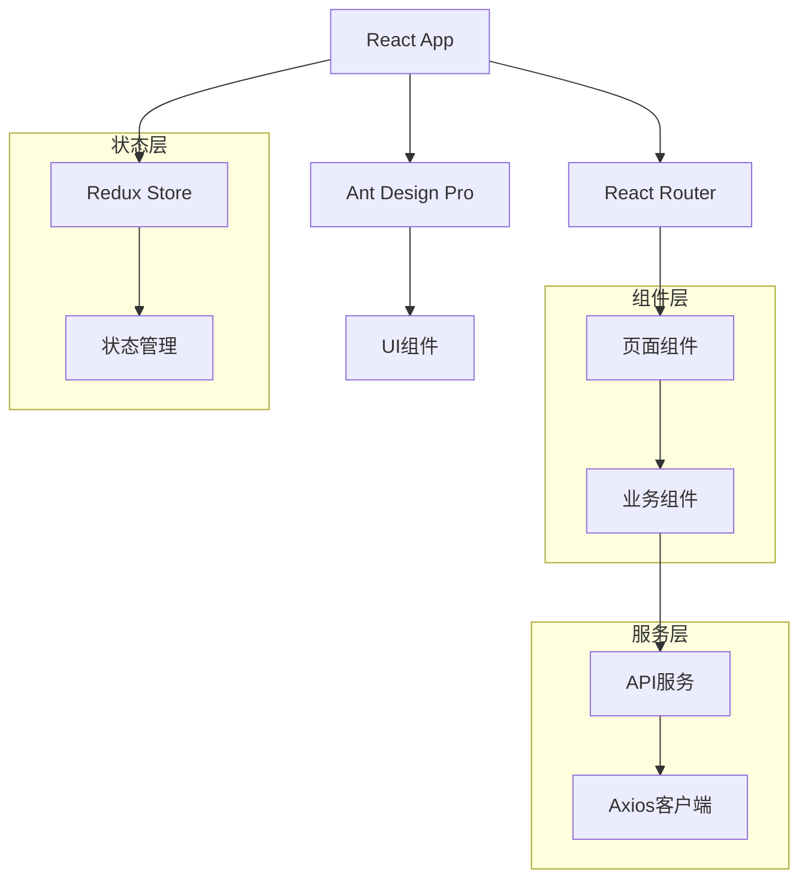

## 1. 架构设计



## 2. 技术栈描述

* **前端框架**: React\@18 + TypeScript\@5

* **构建工具**: Vite\@5

* **UI框架**: Ant Design Pro\@6

* **状态管理**: @reduxjs/toolkit\@2 + react-redux\@9

* **路由**: react-router-dom\@6

* **HTTP客户端**: axios\@1

* **初始化工具**: vite-init

* **后端服务**: 独立后端服务（非Supabase）

* **接口规范**: RESTful API，统一前缀 `/api/v1`

## 3. 路由定义

| 路由路径             | 页面用途        |
| ---------------- | ----------- |
| /login           | 登录页面，用户身份认证 |
| /                | 仪表板首页，系统概览  |
| /assets          | 资产管理列表页面    |
| /assets/:id      | 资产详情页面      |
| /assets/create   | 创建新资产页面     |
| /assets/:id/edit | 编辑资产页面      |
| /settings/users  | 用户管理页面      |
| /settings/roles  | 角色权限管理页面    |
| /settings/menus  | 菜单配置页面      |
| /settings/system | 系统参数配置页面    |
| /profile         | 个人资料页面      |
| /403             | 无权限访问页面     |
| /404             | 页面不存在       |

## 4. API定义

### 4.1 认证相关API

**用户登录**

```
POST /api/v1/auth/login
```

请求参数：

| 参数名      | 参数类型   | 是否必需 | 描述     |
| -------- | ------ | ---- | ------ |
| username | string | 是    | 用户名    |
| password | string | 是    | 密码（明文） |

响应数据：

| 参数名          | 参数类型   | 描述      |
| ------------ | ------ | ------- |
| token        | string | JWT访问令牌 |
| refreshToken | string | 刷新令牌    |
| user         | object | 用户信息对象  |

**获取用户信息**

```
GET /api/v1/auth/profile
```

请求头：

```
Authorization: Bearer {token}
```

### 4.2 资产管理API

**获取资产列表**

```
GET /api/v1/assets
```

查询参数：

| 参数名      | 参数类型   | 是否必需 | 描述        |
| -------- | ------ | ---- | --------- |
| page     | number | 否    | 页码，默认1    |
| pageSize | number | 否    | 每页条数，默认20 |
| keyword  | string | 否    | 搜索关键词     |
| category | string | 否    | 资产分类      |
| status   | string | 否    | 资产状态      |

**创建资产**

```
POST /api/v1/assets
```

请求体：

| 参数名            | 参数类型   | 是否必需 | 描述   |
| -------------- | ------ | ---- | ---- |
| name           | string | 是    | 资产名称 |
| category       | string | 是    | 资产分类 |
| ipAddress      | string | 否    | IP地址 |
| specifications | object | 否    | 规格配置 |
| description    | string | 否    | 资产描述 |

### 4.3 系统管理API

**用户管理**

```
GET /api/v1/admin/users
POST /api/v1/admin/users
PUT /api/v1/admin/users/:id
DELETE /api/v1/admin/users/:id
```

**角色管理**

```
GET /api/v1/admin/roles
POST /api/v1/admin/roles
PUT /api/v1/admin/roles/:id
DELETE /api/v1/admin/roles/:id
```

## 5. 前端架构设计



## 6. 数据模型

### 6.1 前端数据模型定义

**用户模型 (User)**

```typescript
interface User {
  id: string;
  username: string;
  email: string;
  name: string;
  avatar?: string;
  roles: Role[];
  permissions: string[];
  status: 'active' | 'inactive';
  createdAt: string;
  updatedAt: string;
}
```

**资产模型 (Asset)**

```typescript
interface Asset {
  id: string;
  name: string;
  category: string;
  type: string;
  ipAddress?: string;
  macAddress?: string;
  specifications: Record<string, any>;
  status: 'online' | 'offline' | 'maintenance';
  location?: string;
  department?: string;
  owner?: string;
  description?: string;
  tags: string[];
  createdAt: string;
  updatedAt: string;
}
```

**角色模型 (Role)**

```typescript
interface Role {
  id: string;
  name: string;
  code: string;
  description?: string;
  permissions: Permission[];
  menus: Menu[];
  status: 'active' | 'inactive';
  createdAt: string;
  updatedAt: string;
}
```

### 6.2 状态管理结构

**Redux Store结构**

```typescript
interface RootState {
  auth: {
    token: string | null;
    user: User | null;
    isAuthenticated: boolean;
  };
  assets: {
    list: Asset[];
    total: number;
    loading: boolean;
    currentAsset: Asset | null;
  };
  ui: {
    sidebarCollapsed: boolean;
    theme: 'light' | 'dark';
    notifications: Notification[];
  };
}
```

## 7. 项目结构

```
src/
├── components/          # 通用组件
│   ├── Layout/           # 布局组件
│   ├── Common/          # 通用业务组件
│   └── Charts/          # 图表组件
├── pages/               # 页面组件
│   ├── Dashboard/       # 仪表板
│   ├── Assets/          # 资产管理
│   ├── Settings/        # 系统设置
│   └── Login/           # 登录页
├── services/            # API服务
│   ├── api.ts           # API基础配置
│   ├── auth.ts          # 认证相关API
│   ├── assets.ts        # 资产管理API
│   └── system.ts        # 系统管理API
├── store/               # 状态管理
│   ├── index.ts         # Store配置
│   ├── slices/          # Redux切片
│   └── hooks.ts         # 自定义Hooks
├── utils/               # 工具函数
│   ├── request.ts       # 请求封装
│   ├── auth.ts          # 认证工具
│   └── constants.ts     # 常量定义
├── types/               # TypeScript类型定义
├── styles/              # 样式文件
└── config/              # 配置文件
    ├── routes.ts        # 路由配置
    └── menu.ts          # 菜单配置
```

## 8. 开发规范

### 8.1 代码规范

* 使用TypeScript进行类型检查

* 遵循ESLint配置规范

* 组件命名采用PascalCase

* 文件命名采用camelCase

* 常量命名采用UPPER\_SNAKE\_CASE

### 8.2 Git提交规范

* feat: 新功能

* fix: 修复bug

* docs: 文档更新

* style: 代码格式调整

* refactor: 代码重构

* test: 测试相关

* chore: 构建过程或辅助工具的变动

### 8.3 接口规范

* 统一使用RESTful风格

* 接口前缀：/api/v1

* 返回数据格式统一封装

* 错误码规范统一

